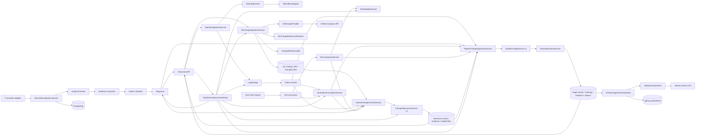

# Architecture

Axiom is a modular monolith so the first delivery has one deployable unit without entangling its future domains. Core domain records do not know GitHub API classes. Provider adapters translate external representations into `PipelineRun` and `PipelineJob`; application services invoke analysis; controllers expose only HTTP DTOs.

`CiProvider` is the seam for CI run integrations; `GitChangeProvider` is the separate provider-neutral seam for source changes. GitHub DTOs remain at the integration edge. `GitChangeIngestionService` resolves persisted base/head metadata, invokes the matching provider, classifies normalized files, and idempotently replaces V7 changed-file rows. Retrieval never calls GitHub implicitly.

Test correlation and rerun analysis operate only on provider-neutral persisted pipeline, failure, and test data. Correlation is durable derived state on each test execution; rerun transitions remain derived from raw executions and pipeline attempt metadata.

`FailureChangeContextService` assembles bounded, persisted evidence for one failure: its optional diagnosis, correlated test and test history, explicit rerun transitions, prior same-fingerprint occurrences, and the current normalized change set. `PipelineChangeAnalysisService` invokes the existing deterministic v1 scorer for every failure and idempotently persists the result, evidence, and related-file links. Retrieval controllers read that derived state without rerunning analysis or calling GitHub.

`PipelineTriageApplicationService` loads persisted failures, diagnoses, test correlations, stability snapshots, rerun transitions, bounded fingerprint history, and change relevance. Optional evidence remains optional. The existing `PipelineTriageService` ranks signals and derives rerun guidance; `DeveloperActionService` maps supported evidence to at most three ordered actions. V11 stores the complete derived triage state idempotently. Triage never calls GitHub, ingests changes, publishes results, or executes reruns.

`PipelineAnalysisOrchestrator` is coordination only. It invokes those same independently callable services in dependency order, reuses current persisted state by default, reports every stage outcome, and continues to triage with partial evidence. It never embeds extraction, classification, relevance, or triage rules and never publishes externally.

GitHub delivery is a separate explicit edge. `GitHubTriageCheckPublisher` reads persisted triage, renders bounded and escaped output, and asks `GitHubChecksClient` to create or update a neutral `Axiom CI Intelligence` Check on the persisted head SHA. V12 tracks the external Check identifier so repeat publication updates one report. The analysis pipeline remains usable without Checks write permission.
