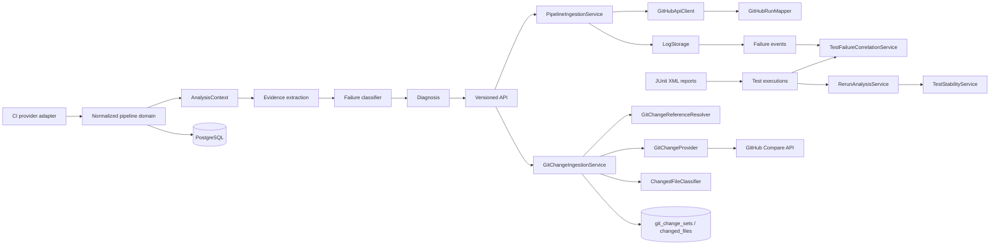

# Architecture

Axiom is a modular monolith so the first delivery has one deployable unit without entangling its future domains. Core domain records do not know GitHub API classes. Provider adapters translate external representations into `PipelineRun` and `PipelineJob`; application services invoke analysis; controllers expose only HTTP DTOs.

`CiProvider` is the seam for CI run integrations; `GitChangeProvider` is the separate provider-neutral seam for source changes. GitHub DTOs remain at the integration edge. `GitChangeIngestionService` resolves persisted base/head metadata, invokes the matching provider, classifies normalized files, and idempotently replaces V7 changed-file rows. Retrieval never calls GitHub implicitly.

Test correlation and rerun analysis operate only on provider-neutral persisted pipeline, failure, and test data. Correlation is durable derived state on each test execution; rerun transitions remain derived from raw executions and pipeline attempt metadata.
