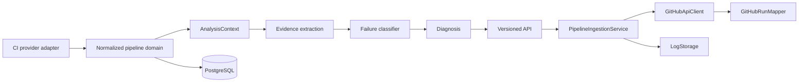

# Architecture

Axiom is a modular monolith so the first delivery has one deployable unit without entangling its future domains. Core domain records do not know GitHub API classes. Provider adapters translate external representations into `PipelineRun` and `PipelineJob`; application services invoke analysis; controllers expose only HTTP DTOs.

`CiProvider` is the seam for GitHub Actions, GitLab CI, and Jenkins. The present GitHub class intentionally throws an explicit unsupported-operation exception: it is a shell, not simulated integration. Future direction is provider ingestion, durable analysis runs, pluggable fingerprinting, and correlation modules while retaining the same domain contract.
