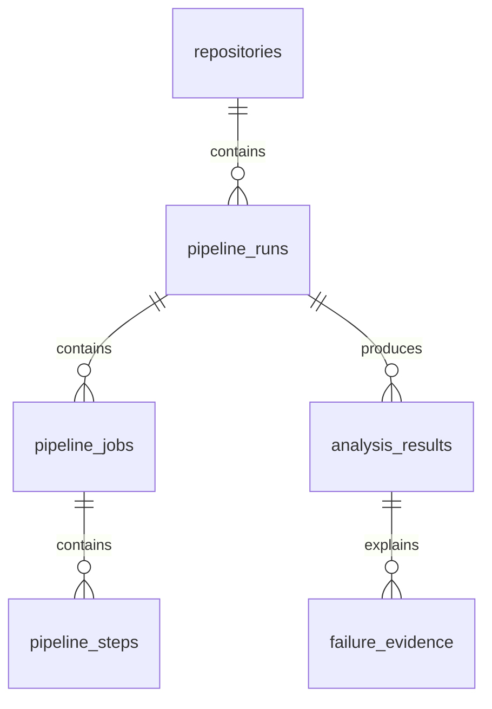

# Data model

The initial schema has provider repositories, their pipeline runs, jobs, and steps, plus analysis results and their evidence. UUIDs identify internal records, while provider IDs are stored separately and indexed.

Flyway owns schema evolution. Hibernate validates rather than creates the schema in the production-style configuration.

